# SmartScheduler

> A Linux kernel module that predicts CPU/memory/I/O spikes using eBPF tracing and online statistical methods — paired with a Rich terminal UI that monitors, flags, and terminates rogue processes with animated visual alerts.

---

## Problem Statement

Modern Linux systems run hundreds of concurrent processes. Manual monitoring via `top` or `htop` is **reactive** — you only see problems *after* they degrade performance. Cryptominers, runaway scripts, and fork bombs can consume entire CPU cores before a human notices. On laptops, battery-mode CPU throttling further distorts usage percentages, causing legitimate applications like VS Code or Chrome to appear as false positives when simple threshold-based detection is used.

**SmartScheduler solves this** by combining kernel-level predictive analytics with an intelligent, blocklist-driven terminal UI that:
- Predicts spikes *before* they peak using statistical trend analysis
- Kills only confirmed-malicious processes from a configurable blocklist
- Never touches safe applications regardless of CPU percentage or power state
- Provides a visual red-pulse alarm animation before each termination

---

## Abstract

SmartScheduler is a **kernel-level research project** demonstrating:

- **Kernel module development** for Linux 6.x — real-time sampling of all running processes at 100ms intervals
- **eBPF tracing** for non-intrusive process monitoring via CPU, memory, and I/O probes
- **Online statistical prediction** using Exponential Moving Averages (EMA) and Rate of Change (RoC) analysis
- **Procfs interface** exposing predictions to user-space tools at `/proc/smartscheduler/*`
- **Rich terminal UI** with blocklist-driven detection, safe-app whitelisting, and animated process termination

The system operates as a pipeline: **kernel samples → EMA smoothing → spike prediction → user-space TUI → blocklist evaluation → animated kill sequence**.

---

## Objectives

1. **Predict resource spikes** before they fully materialise using EMA trend analysis
2. **Eliminate false positives** by using name-based blocklists with absolute thresholds (power-state independent)
3. **Protect safe applications** via a configurable whitelist that prevents accidental termination of IDEs, browsers, and system processes
4. **Provide visual clarity** through a Rich TUI with `htop`-inspired column layout and colour-coded severity
5. **Alert before killing** with a CSS-inspired red-pulse animation sequence
6. **Export data** for offline analysis via CSV and gnuplot integration

---

## Methodology

### Detection Logic Flow

The kernel module samples every process at 100ms intervals, computes smoothed metrics, and exposes spike predictions via `/proc/smartscheduler/predictions`. The Python TUI uses **`psutil` as its primary source of truth** for process discovery (ensuring all running processes are captured even if the kernel module has stale data), then **enriches** each process with kernel-level EMA/RoC predictions. A process is flagged for termination only when both conditions are met: **(1) the process name matches the blocklist AND (2) its CPU usage exceeds the configured threshold**.

```mermaid
flowchart TD
    A["Timer fires every 100ms"] --> B["Sample all processes\n(CPU, MEM, I/O)"]
    B --> C["Update EMA\nEMA = 0.3 × sample + 0.7 × prev"]
    C --> D["Calculate Rate of Change\nRoC = EMA_new − EMA_old"]
    D --> E{"RoC > Threshold?"}
    E -- Yes --> F["Set spike prediction flag\nin /proc/smartscheduler/"]
    E -- No --> G["Clear prediction flag"]
    F --> H["Python TUI reads predictions"]
    G --> H
    H --> I{"Process in blocklist?"}
    I -- No --> J["Display in table\n(informational only)"]
    I -- Yes --> K{"CPU ≥ blocklist threshold?"}
    K -- No --> J
    K -- Yes --> L{"Process in safe_apps?"}
    L -- Yes --> J
    L -- No --> M["🔴 Red Pulse Animation\n(4 second visual alarm: 2 × 2s cycles)"]
    M --> N["SIGTERM → wait 0.5s → SIGKILL"]
    N --> O["Refresh table\n(process removed)"]
```



### Key Algorithms

| Algorithm | Formula | Purpose |
|---|---|---|
| **EMA** | `EMA = α × sample + (1−α) × prev_EMA` | Smooth out noise while tracking trends |
| **Rate of Change** | `RoC = EMA_new − EMA_old` | Detect acceleration of resource usage |
| **Spike Prediction** | `if RoC > threshold → flag` | Anticipate future peaks |

### Prediction Thresholds

| Resource | Threshold | Meaning |
|---|---|---|
| CPU | 2000 | 20% increase rate triggers prediction |
| Memory | 1500 | 15% increase rate triggers prediction |
| I/O | 1000 | 10% increase rate triggers prediction |

### Power State Fix

> **Previous bug:** On battery/power-saver mode, the CPU is throttled, making legitimate heavy apps appear to use disproportionate CPU percentages. The old logic flagged these as spikes.
>
> **Fix:** Detection is now strictly **blocklist + absolute threshold** based. The power state is displayed in the UI as information only — it **never** affects detection sensitivity. Safe apps like VS Code, Chrome, and system processes are whitelisted and can never be killed.

---

## System Design

### Architecture

```
SmartScheduler/
├── kernel/               # Kernel module (C)
│   ├── smartscheduler.c  # EMA engine, spike prediction, procfs interface
│   └── Makefile
├── ebpf/                 # eBPF tracing programs (C)
│   ├── cpu_trace.bpf.c
│   ├── mem_trace.bpf.c
│   ├── io_trace.bpf.c
│   └── Makefile
├── user/                 # User-space tools
│   ├── smartmonitor.py   # ★ Rich TUI monitor v3.0 (Python)
│   ├── blocklist.json    # ★ Process blocklist & safe-app config
│   ├── requirements.txt  # ★ Python dependencies
│   ├── monitor.c         # Legacy C monitor
│   ├── scheduler_daemon.c# Response daemon (nice/ionice adjustments)
│   ├── stress_test.c     # Stress test generator
│   ├── data_exporter.c   # CSV data exporter
│   ├── health_check.c    # System health diagnostics
│   ├── top_spikes.c      # Top spike viewer
│   └── Makefile
├── scripts/              # Build & test helpers
│   ├── setup.sh
│   ├── build.sh
│   └── test.sh
├── keys/                 # Kernel module signing (Secure Boot)
├── logs/                 # Runtime output (gitignored)
├── DEMO_SCRIPT.txt       # Step-by-step demo walkthrough
├── .gitignore
└── README.md
```

### UI Rendering & Animation Cycle


### Column Layout Design Rationale

The table layout follows conventions from `htop`, `btop`, and `glances`:

| Column | Alignment | Width | Rationale |
|---|---|---|---|
| PID | Right | 8 | Numeric → right-aligned per unix convention |
| Process Name | Left | 16–20 | Text → left-aligned, truncated at 20 chars |
| CPU % | Right | 8 | Numeric with colour coding (green/yellow/red) |
| Memory | Right | 10 | Human-readable (MB/GB) right-aligned |
| I/O Rate | Center | 7 | Visual bar (`█░`) for quick scanning |
| Trend | Center | 5 | Arrow indicators (↑↓→) |
| Alert | Center | 10 | Severity badge with colour-coded background |
| Status | Left | 14 | Action text (OK / SPIKE / KILL / SAFE) |

---

## Installation & Usage

### Prerequisites

- Ubuntu 24.04 (or Linux with kernel 6.x)
- Root access for kernel module loading
- GCC, Clang, LLVM, kernel headers
- Python 3.10+ with `rich` and `psutil`

### Quick Start

```bash
# 1. Install system dependencies
sudo ./scripts/setup.sh

# 2. Build kernel module and C tools
./scripts/build.sh

# 3. Install Python dependencies
pip install -r user/requirements.txt

# 4. Load kernel module
sudo insmod kernel/smartscheduler.ko

# 5. Verify module
cat /proc/smartscheduler/status

# 6. Launch the Rich TUI monitor
python3 user/smartmonitor.py
```

### Demo Mode (No Kernel Module Required)

```bash
python3 user/smartmonitor.py --demo
```

### CLI Options

```
python3 user/smartmonitor.py [OPTIONS]

Options:
  --interval, -i  Refresh interval in ms (default: 1000)
  --top, -t       Show top N processes (default: 20)
  --all, -a       Show all tracked processes
  --demo, -d      Demo mode with synthetic data
  --blocklist, -b Path to custom blocklist JSON
```

### Stress Testing

```bash
./user/stress_test cpu 3000 90      # CPU burst: 3s at intensity 90
./user/stress_test mem 256 1000     # Memory: 256MB for 1s
./user/stress_test io 128 1000      # I/O: 128MB for 1s
./user/stress_test auto             # Run all patterns
```

---

## Configuration

### Blocklist (`user/blocklist.json`)

```json
{
    "blocklist": [
        {"name": "cryptominer", "cpu_threshold": 80},
        {"name": "xmrig", "cpu_threshold": 50},
        {"name": "stress-ng", "cpu_threshold": 90},
        {"name": "fork_bomb", "cpu_threshold": 30}
    ],
    "safe_apps": [
        "code", "chrome", "firefox", "gnome-shell", "systemd",
        "bash", "vim", "nvim", "python3", "docker"
    ],
    "global_cpu_kill_threshold": 95,
    "kill_delay_seconds": 2,
    "kill_signal_timeout": 0.5
}
```

| Field | Description |
|---|---|
| `blocklist` | Processes to monitor. Killed when CPU exceeds their threshold. |
| `safe_apps` | Never killed, regardless of CPU usage. |
| `global_cpu_kill_threshold` | Fallback threshold for unlisted processes (default: 95%). |
| `kill_delay_seconds` | Reserved for future use (default: 2s). Animation is currently 4s (2 × 2s pulse cycles). |
| `kill_signal_timeout` | Time in seconds to wait for SIGTERM before sending SIGKILL (default: 0.5s). |

---

## Conclusion

SmartScheduler demonstrates that **predictive scheduling** can be achieved on commodity Linux hardware without modifying kernel source. By combining kernel-level EMA/RoC analysis with an intelligent user-space TUI, the system moves monitoring from reactive to **proactive** — predicting spikes before they peak, identifying truly malicious processes via blocklists rather than fluctuating CPU percentages, and providing satisfying visual feedback before automated termination.

The power-state-independent detection logic solves a real-world pain point where battery-throttled laptops produced constant false positives against legitimate applications. The blocklist + safe-app architecture ensures that system-critical and user-trusted applications are never at risk, even when CPU usage is high.

---

## License

GPL v2 (required for kernel modules)

## Author

SmartScheduler Research Team
